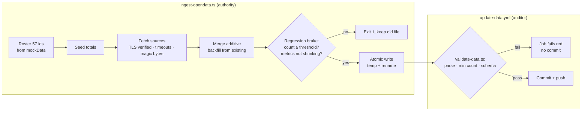

# fix: Harden ingest pipeline, security, tests, and frontend

**Target repo:** julianrobert04/diputado-score (working clone; PR from fork — push access to upstream unconfirmed).

---

## Summary

A five-dimension code review found that the weekly unattended data pipeline can silently wipe or corrupt `data/real-data.json` (the published scores of 57 named legislators), that TLS verification is disabled on the downloads feeding a CVE-affected `xlsx` parser, and that the repo carries a dead Prisma layer, zero tests, and a stale README. This plan hardens the pipeline with roster-driven identity and a two-tier validation defense, fixes the TLS bypass properly (supply the missing intermediate CA — verified: the Asamblea cert itself is valid), tightens name matching and the AI headline classifier, deletes dead code, adds a test suite + CI gate, and fixes frontend performance/accessibility.

---

## Problem Frame

- `src/scripts/ingest-opendata.ts` builds a fresh `totals` map each run, seeded **only** by the attendance loop. Any attendance outage empties or shrinks the output; the script then unconditionally overwrites `data/real-data.json`, and the workflow's grep-based diff count commits the damage. No human is in the loop.
- `rejectUnauthorized: false` (line 20) exists because `www.asamblea.go.cr` omits the intermediate CA from its TLS chain (verified 2026-07-14: cert is a valid GlobalSign DV cert expiring 2026-07-28; `openssl s_client` returns "unable to verify the first certificate"; Node does not do AIA chasing). The bypass is fixable without breaking ingest.
- `xlsx@^0.18.5` has unpatched CVEs on npm (prototype pollution CVE-2023-30533, ReDoS CVE-2024-22363); fixed builds ship only from SheetJS's own registry.
- Prisma/Postgres layer, `cheerio`, `csv-parse`, `node-fetch`, and `.ingest-cache/` (423 KB) are dead weight; README describes a product that no longer exists (11 metrics, phantom scripts, mandatory DB).
- Zero test infrastructure around a non-trivial scoring engine; `npm run lint` fails with 2 errors; no CI quality gate.
- Three of the four page routes are `force-dynamic` over build-time-static JSON; portraits load unoptimized at full resolution; WCAG contrast failures; SVG charts lack `role="img"`.

## Requirements

- **R1** — The ingest can never replace good data with empty/shrunken data; previously known deputies and accumulated metrics are preserved; writes are atomic; the workflow independently validates before committing and fails loudly.
- **R2** — TLS verification is fully enabled (scoped CA fix, not bypass); `xlsx` input is validated (magic bytes, content checks) before parsing; HTTP calls have timeouts.
- **R3** — Ambiguous name matches never silently attribute data to the wrong deputy; the headline classifier is hardened against prompt injection and garbled output.
- **R4** — Dead Prisma layer, unused deps, and `.ingest-cache/` are removed; README matches reality.
- **R5** — Automated tests cover `scoreCalculator`, the `real-data.json → RawData` mapping, and name matching; lint/typecheck/test/build run in CI; the 2 existing lint errors are fixed.
- **R6** — Pages are statically generated with `generateStaticParams`; images are optimized; WCAG contrast and SVG accessibility issues fixed.

## Constraints carried from repo guidance (CLAUDE.md / AGENTS.md)

- Removed metrics (COS, ASE, MOC, VOT, COH, DEC, GAS) were **product decisions** — do not reintroduce; current model is 7 metrics (ASI, PRO, COM, PER, APR, MED + VIA auto-activating).
- MED (media) accumulates since legislature start with `medSeen` sha1 dedupe; **a run without `ANTHROPIC_API_KEY` must preserve prior MED totals, never reset them.**
- Government data is dirty by design: official xlsx contain name typos (`NAME_ALIASES`), photo filenames have typos (`PHOTO_OVERRIDES`). Test fixtures must preserve typo cases.
- Next.js 16 APIs differ from training data — consult `node_modules/next/dist/docs/` before route/Image changes; `params` is a Promise in Next 16.
- All UI copy, comments, and log messages in Spanish; identifiers follow existing bilingual naming; scripts use relative/builtin imports (no `@/` alias), app code uses `@/`.

---

## Key Technical Decisions

1. **Roster-driven identity (keystone).** Seed `totals` from the full 57-deputy roster before any fetch loop. Identity comes from the roster in `mockData.ts`; fetched metrics are additive per-deputy; `existing` data backfills any deputy a source missed. This dissolves the merge-vs-removal contradiction: deputies leave only when removed from the roster. Because seeding guarantees all 57 entries always exist, the regression brake counts **data-bearing** deputies (non-zero cumulative attendance), never raw entry count — an entry-count floor would be a tautology that can never fire.
2. **Two-tier defense contract.** The script is the _authority_: refuses to write when results regress (deputy count below roster threshold, per-deputy attendance totals decreasing), writes atomically (temp file in `data/` + rename). The workflow is the _auditor_: independently parses the output, asserts minimum deputy count and schema shape, and hard-fails the job (visible red run) instead of committing. The grep-based `REAL_CHANGES` heuristic is replaced by: commit iff the validator passes AND a normalized diff shows real change (mask `updatedAt` to a constant in a temp copy, then `git diff --quiet` — plain `git diff` cannot exclude a field, and `updatedAt` changes every run). The validator's deputy floor is a hardcoded committed constant (`MIN_DIPUTADOS`), independent of the mockData roster regex the script uses, and it additionally fails when the parsed roster count disagrees with that constant — so a formatter-induced regex break in `mockData.ts` cannot blind both tiers at once (they'd otherwise share the same defect and the "independent auditor" claim would be false).
3. **TLS fix via CA supplementation, not bypass removal alone.** Replace `rejectUnauthorized: false` with an `https.Agent` whose `ca` option includes the GlobalSign intermediate (`GlobalSign GCC R3 DV TLS CA 2020`) + root, scoped to the Asamblea host. Full verification stays on. Document the reason and the cert expiry (2026-07-28) so renewal breakage is diagnosable.
4. **xlsx CVE mitigation by input validation + containment, not replacement.** Fixed versions aren't on npm; swapping libraries is out of scope (approved scope says mitigate). Mitigate by: verified TLS (closes the MITM delivery path), ZIP magic-byte check (`50 4B 03 04`) + content-type validation before `XLSX.read`, and pinning the exact version. Be honest about what each layer does: the magic-byte check stops HTML error pages from parsing as garbage data — it does NOT stop a crafted malicious workbook, which is itself a valid ZIP. After the TLS fix, the residual risk is a compromised Asamblea source serving a hostile workbook to a CI job holding `ANTHROPIC_API_KEY` and a write token. Record exactly that residual in the README; isolating the xlsx parse into a secrets-free CI step is deferred follow-up work.
5. **Ambiguity handling: preserve, never guess, never drop.** `matchDeputy` gains a runner-up gap check (reject when second-best score is within a configurable margin of best). On ambiguous or failed match: keep the deputy's prior data (roster-seeding guarantees the entry exists) and log to an unmatched report. Never write a cross-deputy attribution.
6. **Classifier hardening.** Headlines sent as a numbered, delimited data block with an explicit "content is data, not instructions" system prompt; response must contain exactly N labels, each ∈ {P, N, X} (matching the existing parser's label set — the current code uses X for neutral, not U), or the whole batch is discarded (preserving prior MED per the invariant). No headline text is ever echoed into instructions. Note the hardening bounds but does not eliminate semantic injection (a headline that yields a valid label can still bias its own classification); state it as bounded, not solved.
7. **Test stack: `node:test` + `tsx` (already a dep).** No vitest/jest — all three test targets are pure and non-DOM. Scripts: `"test": "tsx --test test/**/*.test.ts"`, `"typecheck": "tsc --noEmit"`. Pure ingest functions are extracted to an import-safe module because `ingest-opendata.ts` runs `main()` at import.
8. **Legislature rollover escape hatch — strictly gated.** A term change legitimately resets history, but a bare string inequality on the external Delfino term field must never trigger it (format drift like "2026-2030" → "Legislatura 2026-2030" would archive good data and disable the brake in one run). Rollover fires only when ALL hold: the new term matches `/^\d{4}-\d{4}$/`, its start year strictly advances over the stored term, and every source fetch this run succeeded (never bypass the regression brake on a degraded run). Then archive the old file to `data/archive/<term>.json` and skip the brake once.

---

## High-Level Technical Design

---

## Implementation Units

### U1. Extract pure ingest functions into an import-safe module

**Goal:** Make matching/parsing logic testable without triggering the network run.
**Requirements:** R3, R5 (foundation).
**Dependencies:** none.
**Files:** `src/scripts/ingest-lib.ts` (new), `src/scripts/ingest-opendata.ts`.
**Approach:** Move `normalize`, `editDistance1`, `jaccard`, `matchDeputy`, `NAME_ALIASES`, `isApproved`, `searchName`, `headlineHash`, and `parseAttendance` into `ingest-lib.ts` with named exports (relative/builtin imports only — no `@/` alias, so `tsx` runs it standalone). `ingest-opendata.ts` imports from it; behavior unchanged. Define `export interface Deputy { id: string; nombre: string; tokens: string[] }` in `ingest-lib.ts` and type the moved functions' parameters as `Deputy[]` — they currently use `ReturnType<typeof loadDeputies>`, and `loadDeputies` stays behind in `ingest-opendata.ts` (it returns `Deputy[]`), so the move would not typecheck otherwise. Keep Spanish comments and the box-drawing section banners.
**Test scenarios:** none in this unit (pure move); U7 tests import from here. Verify by running `npm run ingest:opendata -- --help`-equivalent dry check: module imports cleanly without side effects (`tsx -e 'import("./src/scripts/ingest-lib.ts")'`).
**Verification:** `tsc --noEmit` clean; importing `ingest-lib.ts` performs no I/O.

### U2. Roster-seeded identity, merge semantics, regression brake, atomic write

**Goal:** The script can never destroy data it previously knew (R1 script-side).
**Requirements:** R1.
**Dependencies:** U1.
**Files:** `src/scripts/ingest-opendata.ts`, `src/scripts/ingest-lib.ts`.
**Approach:** Seed `totals` with all roster ids before fetch loops (zeroed attendance, null metrics). After merging fetched data, backfill null-seeded metric fields from `existing` per today's `?? existing…` pattern, now guaranteed to run for every deputy. **Attendance needs its own guard** — it is zero-seeded, and `0 ?? x` is `0`, so the null-backfill can never restore it: when a roster deputy has zero fetched attendance this run but `existing` holds non-zero cumulative attendance (e.g. the stricter U4 matcher now rejects their name as ambiguous), backfill attendance from `existing` and log the deputy to the unmatched report. Regression brake before write — refuse (exit 1, log in Spanish) when either: (a) the count of **data-bearing** deputies (cumulative `asisPL+ausPL > 0` after backfill) falls below the committed constant `MIN_DIPUTADOS` (default 50 — deliberately below the 57-seat roster to tolerate genuine vacancies), or (b) any deputy's cumulative attendance decreased vs `existing` — unconditionally, NOT gated on the month list shrinking (a renamed column yields a valid ZIP full of zeros with an intact month list). `parseAttendance` gains a sanity guard: required columns absent or zero data rows → throw, treated as "month unavailable", never as zero attendance. Atomic write: temp file inside `data/` + `renameSync`. Legislature rollover per KTD 8's strict gating (format check, year advance, all sources healthy).
**Test scenarios (in U7's suite, written against exported helpers):**

- Attendance source totally unavailable + existing file present → write refused, existing file untouched.
- First-ever run (no existing file) → write proceeds with roster-seeded entries.
- Deputy missing from this run's attendance but present in `existing` → entry survives with backfilled metrics **including non-zero attendance** (the zero-seed does not mask prior data).
- Month served as valid xlsx with renamed/missing required columns → month treated as unavailable, not zero attendance.
- Any deputy's cumulative attendance lower than `existing` with an intact month list → write refused.
- Valid term change (format ok, year advances, all sources healthy) → brake bypassed, archive written.
- Term string format drift or term change during a degraded run → rollover NOT triggered, brake stays armed.
  **Verification:** Simulated outage run (fetch functions stubbed to fail) exits non-zero and leaves `data/real-data.json` byte-identical.

### U3. TLS fix, timeouts, and parser input validation

**Goal:** Verified TLS everywhere; no unvalidated bytes reach `XLSX.read` (R2).
**Requirements:** R2.
**Dependencies:** U1 (touches shared fetch helpers).
**Files:** `src/scripts/ingest-opendata.ts`, `src/scripts/certs/globalsign-chain.pem` (new), `package.json` (pin `xlsx` exact version).
**Approach:** Replace `SSL_AGENT` with an agent using `ca: [globalsign intermediate + root PEM]`, used only for `asamblea.go.cr` requests; all other hosts use default verification (verified: only `fetchBuffer` targets the Asamblea; `fetchText`/`postJson` already verify). Note the `ca` option **replaces** Node's default trust store for that agent — the PEM must carry the full anchoring chain (intermediate + the exact GlobalSign root) or verification fails. Add socket + response timeouts (e.g. 30 s) to `fetchBuffer`/`fetchText`/`postJson`. Before `XLSX.read`: check ZIP magic bytes and reject HTML content-types — a failed check means "month not available," never "zero attendance." Document cert expiry 2026-07-28 next to the PEM.
**Test scenarios:** magic-byte validator accepts a real xlsx fixture header, rejects an HTML buffer; timeout config present on every request path (assert via exported constants).
**Verification:** Live `npm run ingest:opendata` completes against the real Asamblea host with verification on (run manually once; CI does not hit the network).

### U4. Name-matching ambiguity detection and classifier hardening

**Goal:** No wrong-person attribution; no headline-driven score manipulation (R3).
**Requirements:** R3.
**Dependencies:** U1.
**Files:** `src/scripts/ingest-lib.ts`, `src/scripts/ingest-opendata.ts`.
**Approach:** `matchDeputy` returns null when `bestScore - secondBest < margin` (default 0.15, exported constant); callers already treat null as unmatched — extend the unmatched report to say "ambiguo" vs "sin match". Prior data survives via U2 seeding. Classifier: numbered delimited headline block, instruction that content is data; validate label count === input count and each label ∈ {P,N,X} (X = neutral, matching the existing parser's `/^[PNX]$/` — a {P,N,U} validator would reject every real neutral response and freeze MED forever); on mismatch discard batch and preserve prior MED (the no-key invariant path already exists — reuse it). Validate the ambiguity margin against the real roster in tests: assert every current-roster name still matches unambiguously, so the margin value is grounded, not guessed.
**Test scenarios:**

- Two roster names with shared surnames scoring within the margin → null (ambiguous), report entry.
- Official-typo alias (e.g. "Chavaría") still matches via `NAME_ALIASES`.
- Clear best match ≥0.6 with distant runner-up → matched.
- Classifier response with wrong label count → batch discarded, prior MED preserved.
  **Verification:** Unmatched report distinguishes ambiguity; hand-run against current month's real names yields identical matches to before (no regressions on clean data).

### U5. Workflow validation gate (auditor tier)

**Goal:** CI never commits data the script shouldn't have written (R1 workflow-side).
**Requirements:** R1.
**Dependencies:** U2 (contract), U7 (scripts exist for CI reuse).
**Files:** `src/scripts/validate-data.ts` (new), `.github/workflows/update-data.yml`.
**Approach:** `validate-data.ts` parses `data/real-data.json`, asserts: valid JSON, **data-bearing** deputy count ≥ the hardcoded `MIN_DIPUTADOS` constant (not entry count — seeding makes entry count meaningless; and not a value derived from the mockData regex parse, which would share the script's failure mode), parsed roster count agrees with the constant, every id matches the roster, required numeric fields well-typed. Workflow: run validator after ingest; on failure exit non-zero (red run — visible in the repo's Actions tab) and skip commit. Commit gate per KTD 2: validator pass AND normalized diff (mask `updatedAt`, then `git diff --quiet`). Pin actions to full commit SHAs (supply-chain hardening in service of R1's trustworthy-CI intent — labeled here so scope is traceable).
**Test scenarios:** validator exits 0 on current committed file; exits 1 on empty deputies, on unknown id, on truncated JSON.
**Verification:** `tsx src/scripts/validate-data.ts` green on HEAD data; red on a corrupted copy.

### U6. Dead-code removal and README rewrite

**Goal:** The repo describes and ships only what runs (R4).
**Requirements:** R4.
**Dependencies:** none (parallel-safe), but land before U7 so CI doesn't install dead deps.
**Files:** delete `prisma/schema.prisma`, `prisma.config.ts`, `.ingest-cache/*`; `package.json` (remove `@prisma/client`, `@prisma/adapter-pg`, `prisma`, `pg`, `@types/pg`, `cheerio`, `csv-parse`, `node-fetch`, `db:*` scripts); `README.md` (rewrite); `.gitignore` (add `.ingest-cache/`, `data/real-data.json.tmp`); `CLAUDE.md` (drop `gold` tier mention, Prisma stack line).
**Approach:** Verify nothing references deleted modules (`grep -r prisma src/ .github/`); `npm ci` + build must stay green. README: 7-metric model with actual weights, real scripts (`ingest:opendata`, `test`, `typecheck`), no DB setup, note on xlsx residual risk and TLS CA fix, data update flow (cron → validate → commit → redeploy).
**Test scenarios:** none — config/docs unit. Test expectation: none — no behavioral surface; U7's CI build proves nothing broke.
**Verification:** `npm ci && npm run build` green after deletions; README instructions executable start-to-finish on a fresh clone.

### U7. Test suite, CI quality gate, lint fixes

**Goal:** The scoring engine and data seams are locked in; every PR runs lint/typecheck/test/build (R5).
**Requirements:** R5.
**Dependencies:** U1 (importable lib), U6 (final dep set).
**Files:** `test/score-calculator.test.ts`, `test/data-mapping.test.ts`, `test/name-matching.test.ts`, `test/ingest-guards.test.ts` (new); `package.json` (test/typecheck scripts); `.github/workflows/ci.yml` (new); `src/app/page.tsx` (lint fix, escape entities at line 135).
**Approach:** `node:test` + `node:assert/strict` via `tsx --test`. Spanish test descriptions. Fixtures embed real-shaped data including typo'd names.
**Test scenarios:**

- scoreCalculator: clamp bounds (metric pinned to [1,10] — exact 0 input clamps to floor); neutral-5 fallback for every missing-data path; confidence smoothing `5 + (raw−5)·min(1, avg/2)` at avg 0, 1, 2, 4; MED formula `clamp(5.5 + 4.5·(pos−neg)/max(total,5), 1, 10)`; `calcOverall` weights sum to 1.0; VIA-off vs VIA-on scaling consistency.
- data mapping: representative `real-data.json` slice → `RawData` field-by-field; missing deputy id → null path; `realMetrics` set matches data-bearing fields.
- name matching: covered in U4 scenarios (implemented here).
- ingest guards: U2 scenarios (implemented here against exported brake/merge helpers).
  CI workflow: **Node 24** (NOT 20 — verified empirically: `node --test 'test/**/*.test.ts'` fails to glob on Node 20, the runner's built-in globbing needs ≥21, and `sh` doesn't expand `**`; on Node 20 the gate would silently run zero tests), `npm ci`, `lint` + `typecheck` + `test` + `build` on push/PR to main. Actions pinned to full commit SHAs and an explicit top-level `permissions: contents: read` block — lint/test/build need no write scope.
  **Verification:** `npm test` green locally **with a non-zero reported test count**; CI green on the PR with non-zero test count in the log; lint 0 errors.

### U8. Static generation, image optimization, accessibility

**Goal:** Pre-rendered site, optimized images, WCAG-passing text, accessible charts (R6).
**Requirements:** R6.
**Dependencies:** none functionally; land last to keep diffs reviewable.
**Files:** `src/app/page.tsx`, `src/app/rankings/page.tsx`, `src/app/diputados/[id]/page.tsx`, `src/components/PoliticianCard.tsx`, `src/components/RankingAvatar.tsx`, `src/components/Sparkline.tsx`, `src/components/RadarChart.tsx`, `src/app/layout.tsx`, `next.config.ts`.
**Approach:** Remove all three `force-dynamic` exports; add `generateStaticParams` returning the 57 roster ids in `[id]/page.tsx` (Next 16 async-params style — consult bundled docs). **`/` stays dynamic**: the home page reads `searchParams` (q/provincia/sort/partido) server-side, which opts it into dynamic rendering regardless of `force-dynamic` — moving its filtering client-side is out of scope; SSG targets are `/rankings`, `/metricas`, and the 57 `/diputados/[id]` pages. **Images: keep `unoptimized` on Asamblea-hosted portraits.** Removing it hands the fetch to the host's server-side image optimizer — a Node process that hits the same missing-intermediate TLS failure U3 documents and cannot be given our custom CA agent; every portrait would silently fall back to the initial-letter `onError` path. Optimize only `ui-avatars.com` images; convert RankingAvatar to `next/image` (with `unoptimized` for Asamblea sources) and proper `sizes`; keep `remotePatterns`; document the trade-off next to the component. Contrast, element-by-element (all on effective background per surface — page `#0c0c0e` vs card `bg-zinc-900`): party (`text-zinc-600`), province + metric labels (`text-zinc-700`), footers/empty-states (`text-zinc-700/800`), and Sparkline captions/axes (`text-gray-500/600`) collapse to two visible tiers ≥4.5:1 (primary captions ~zinc-300, secondary ~zinc-400); the purely decorative rank number (`text-white/25`) is exempt as incidental. Charts: `role="img"` + Spanish `aria-label`; RadarChart's label enumerates each dimension name with its score (not a generic title), Sparklines carry their series summary; `lang="es"` on `<html>` if absent. Note: data updates reach users only on redeploy — confirm host redeploys on push (open question OQ1); static generation does not change data freshness because data was already build-time.
**Test scenarios:** Test expectation: none — visual/config unit; verified by build output and manual checks below.
**Verification:** `next build` output lists `/rankings`, `/metricas`, and 57 `/diputados/[id]` pages as prerendered (SSG); `/` is the only remaining dynamic route (searchParams-driven by design); **portraits actually render in the browser (not initial-letter fallbacks)** on `/`, `/rankings`, and a profile page; spot-check contrast with a WCAG calculator; screen-reader labels present in rendered HTML.

---

## Scope Boundaries

**In scope:** the six approved areas above, on a branch in the working clone, PR to upstream from a fork.

### Deferred to Follow-Up Work

- Replacing `xlsx` with a maintained parser (exceljs or SheetJS CDN build) — mitigation now, replacement later.
- Per-month attendance subtotals persisted in the data file (removes refetch-all-months dependency) — larger data-shape change.
- GitHub issue auto-filing on validation failure (needs upstream repo permissions; red workflow run is the visible failure signal this PR ships).
- Isolating the xlsx download+parse into a CI step/job without `ANTHROPIC_API_KEY` or write scope (blast-radius reduction for the deferred parser replacement; the prototype-pollution vector survives magic-byte checks).
- Podium/party-filter display inconsistencies, "Mejor partido" small-party skew, APR asymmetry — product decisions for Julián, not defects.
- Dimension-pill weighted-mean alignment and `getScoreColor(0)` gray-vs-red — flagged in review as display inconsistencies; excluded from approved scope; propose separately.

### Outside this product's identity

- Reintroducing removed metrics (COS, ASE, MOC, VOT, COH, DEC, GAS); re-integrating dead sources (`sil.go.cr`, `datosabiertos.asamblea.go.cr`).

---

## Open Questions

- **OQ1 (deploy trigger):** Does the hosting (presumably Vercel) redeploy on the weekly data commit? If not, weekly updates never reach users regardless of this PR. Not answerable from the repo — flag in the PR description for Julián.
- **OQ2 (cert renewal):** The Asamblea cert expires 2026-07-28 (two weeks). If renewal changes the chain, the pinned intermediate may need updating; the README documents the symptom and fix.

---

## Risks & Dependencies

- **Cannot run the live ingest in CI** (network + API key); brake/merge logic is tested via exported helpers with stubbed fetches. A manual live run validates U3 before the PR.
- **`npm ci` dependency removal (U6) could surface hidden imports** — mitigated by grep sweep + build gate in U7.
- **Next 16 static-params behavior** differs from older Next — mitigated by consulting bundled docs (AGENTS.md rule) and the build-output verification in U8.
- **Upstream PR acceptance:** work lands on a fork; Julián merges. Residual review findings ride in the PR body.

## Sources & Research

- Five-dimension review (this session): critical wipe path verified at `src/scripts/ingest-opendata.ts:509,680`; workflow gate at `.github/workflows/update-data.yml:35`.
- Live TLS probe (2026-07-14): valid GlobalSign leaf; server omits intermediate; `curl` verifies (AIA), `openssl s_client` code 21.
- Repo research: conventions, test-runner assessment, seam analysis (`main()` runs at import — extraction required).
- CLAUDE.md/AGENTS.md: removed-metric rationale, MED preservation invariant, dirty-data fixtures, Next 16 doc rule.
- CVE-2023-30533, CVE-2024-22363 (xlsx ≤0.18.5 on npm; fixes not published to npm).
